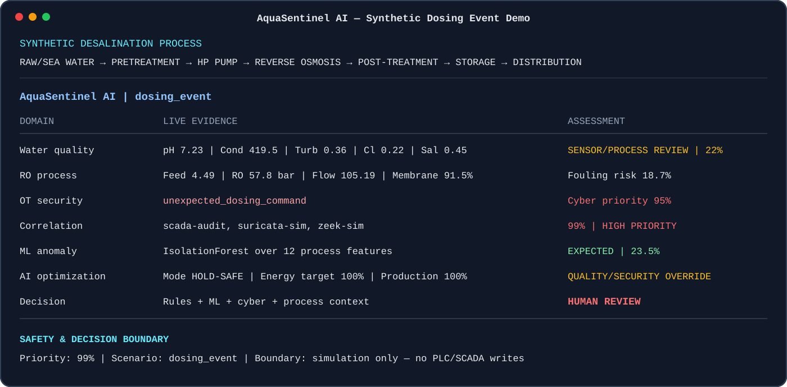

# AquaSentinel AI

### Smart Water & Desalination Infrastructure Security Platform

[](https://github.com/HaziqBinAfzal/AquaSentinel/actions/workflows/ci.yml)


**EduQual Level 6 Diploma in Artificial Intelligence Operations — Oral Examination Project, Topic 133**  
**Student:** Haziq Shahzad  
**Release Candidate:** v1.0.0-rc1

> **Examiner quick start:** On Windows, download or clone the repository, extract it to a normal folder and double-click `AquaSentinel.bat`. The launcher creates an isolated environment, installs the project, verifies it, runs automated quality and security checks, performs functional smoke tests and then starts the guided Topic 133 demonstration.

## Verified Terminal Preview

The preview below represents the deterministic `dosing_event` classroom scenario used by AquaSentinel. It demonstrates water-quality review, simulated OT/SCADA evidence, cyber-physical correlation, the `HOLD-SAFE` advisory state and the final `HUMAN REVIEW` decision.



> This is a documentation rendering of deterministic project output, not a live industrial plant screen. All telemetry, security events and process conditions are synthetic.

---

## Project Overview

AquaSentinel AI is a terminal-first educational platform built to demonstrate how artificial intelligence, operational technology security, water-quality monitoring and resource optimization can be combined around a modern desalination and critical-water environment.

The project was created around Topic 133:

> **Orchestrating Smart Water and Desalination Infrastructure Security Platform with OT Protection, Quality Monitoring, and AI-Driven Resource Optimization for Critical Water Systems.**

Instead of presenting the topic only as theory, AquaSentinel turns the main concepts into an interactive and explainable demonstration. It generates controlled synthetic desalination telemetry, evaluates water-quality conditions, applies an IsolationForest anomaly model, correlates simulated OT/SCADA security evidence, estimates membrane-fouling risk, produces guarded resource recommendations and presents the result through an industrial-style terminal dashboard.

The central design principle is simple: **AI remains advisory**. Water quality, cybersecurity evidence, engineering constraints, public-health considerations and human authority remain above automated recommendations.

> **Safety boundary:** AquaSentinel is a synthetic, defensive classroom project. It does not connect to, operate, control or modify a real water utility, desalination plant, PLC, SCADA system, dosing controller or public-health infrastructure. Thresholds and response logic are illustrative and are not operational or regulatory instructions.

---

## Why This Project Was Built

Modern water and desalination facilities are cyber-physical systems. A cybersecurity event can matter because it may affect industrial equipment or the quality of water, while an unusual sensor value may have many possible causes. AquaSentinel therefore does not treat network alerts, water-quality measurements or AI predictions as isolated facts.

The project demonstrates a safer approach:

```text
Synthetic Process Telemetry
          |
          +---- Water-quality rules
          +---- AI anomaly detection
          +---- OT / SCADA evidence
          +---- Maintenance analytics
          |
          v
Cyber + Process + Quality Correlation
          |
          v
Guardrailed Recommendation
          |
          v
Human Review / Monitor
          |
          v
Audit Evidence + Exam Report
```

The aim is not to prove that AI should independently operate a water facility. The aim is to show how AI can help a human operator understand evidence, prioritize anomalies and make better-informed decisions while safety remains the overriding constraint.

---

## What AquaSentinel Demonstrates

| Area | Project demonstration |
| --- | --- |
| **Water Treatment / Desalination** | Synthetic raw/sea-water, pretreatment, high-pressure pumping, reverse osmosis, post-treatment and storage context |
| **OT / SCADA Security** | Segmented architecture and passive synthetic Zeek-style, Suricata-style and SCADA-audit evidence |
| **Water Quality** | pH, conductivity, turbidity, residual chlorine and salinity monitoring with cross-sensor reasoning |
| **Artificial Intelligence** | `scikit-learn` IsolationForest anomaly detection over multiple process features |
| **Cyber-Physical Correlation** | Security evidence is compared with independent quality and process evidence before escalation |
| **Predictive Maintenance** | Membrane health, pressure, flow and energy patterns contribute to synthetic fouling-risk analysis |
| **Resource Optimization** | Advisory energy and production recommendations with quality, security and equipment guardrails |
| **Incident Response** | Human-led eight-stage response workflow from detection through evidence preservation |
| **DevSecOps** | Automated tests, linting, defensive security scanning, CI, package integrity and Windows launcher verification |
| **Audit / Reporting** | JSONL audit evidence and structured JSON exam reports |
| **Assurance Context** | Educational mapping to NIST SP 800-82 concepts and EPA/WHO water-safety context |

---

## System Architecture

```text
                    Enterprise / SOC
                           |
                    Industrial DMZ
                           |
                      OT / SCADA
                           |
             Passive synthetic security evidence
                           |
                   Safety & Quality
                           |
              Independent validation evidence
                           |
              Synthetic treatment process
                           |
                        Telemetry
                           |
          +----------------+----------------+
          |                |                |
     Quality Rules      AI / ML       OT Correlation
          |                |                |
          +----------------+----------------+
                           |
              Maintenance / Optimization
                           |
                      Human Review
                           |
                 Terminal Dashboard
                           |
                    Audit / Report
```

The simulated desalination path is:

```text
Raw / Sea Water
      -> Pretreatment
      -> High-Pressure Pump
      -> Reverse Osmosis
      -> Post-Treatment / Disinfection
      -> Storage
      -> Distribution Context
```

AquaSentinel is deliberately read-only from the application's perspective. It analyzes synthetic evidence and contains no path for issuing commands to real industrial controllers.

---

## How the Platform Works

### 1. Synthetic telemetry

`telemetry.py` generates deterministic classroom data for pH, conductivity, turbidity, residual chlorine, salinity, feed pressure, RO pressure, flow rate, temperature, tank level, pump state, energy use, membrane health and synthetic cyber events.

Using deterministic synthetic data makes demonstrations repeatable and avoids any requirement for access to real infrastructure.

### 2. Transparent water-quality analysis

`analytics.py` performs understandable rule-based checks. One abnormal sensor is treated as evidence, not automatic proof of contamination. Related measurements can then be cross-checked before the system raises priority.

### 3. Real ML anomaly detection

`ml.py` trains a real `scikit-learn` IsolationForest model against a synthetic normal baseline. It evaluates multiple process variables together and provides an expected/anomalous state plus an ML priority score.

The ML result is advisory and appears beside transparent rules instead of replacing them.

### 4. Synthetic OT / SCADA evidence

`security.py` creates controlled Zeek-style, Suricata-style and SCADA-audit observations. These are simulation artifacts used to explain security monitoring and correlation; AquaSentinel does not perform attacks or connect to real OT networks.

### 5. Cyber-physical correlation

A network alert alone does not prove physical impact. AquaSentinel therefore compares cyber evidence with independent process and water-quality evidence to demonstrate how a possible cyber-physical incident can be prioritized more intelligently.

### 6. Predictive maintenance

The `fouling` scenario gradually changes membrane health, pressure, flow and energy demand to demonstrate predictive-maintenance reasoning.

### 7. Guardrailed optimization

`optimizer.py` creates advisory energy and production recommendations. If water quality or security evidence becomes concerning, the system moves to `HOLD-SAFE` rather than continuing to optimize for efficiency.

### 8. Human-led incident response

The incident workflow follows:

```text
DETECT -> VALIDATE -> CORRELATE -> ASSESS -> CONTAIN -> VERIFY -> RECOVER -> EVIDENCE
```

The steps explain safe decision-making without providing real industrial-control instructions.

---

## Industrial Terminal Dashboard

AquaSentinel is intentionally terminal-first. Its Rich-based console is designed to feel closer to an operator/SOC view than a normal Python script while remaining lightweight enough for an exam laptop.

It shows the desalination process, live synthetic measurements, water-quality status, AI anomaly state, simulated OT evidence, cyber-physical correlation, overall risk, predictive-maintenance information, guardrailed optimization advice, recent events and the permanent synthetic/read-only boundary.

Run the industrial view with:

```bash
aquasentinel live --scenario dosing_event --samples 40 --refresh-rate 4 --fullscreen
```

---

## Controlled Demonstration Scenarios

| Scenario | Demonstrates |
| --- | --- |
| `normal` | Expected synthetic desalination operation |
| `sensor_anomaly` | An unusual sensor without automatically declaring contamination |
| `quality_anomaly` | Multiple related quality deviations and cross-sensor validation |
| `dosing_event` | Synthetic OT/SCADA evidence and cyber-physical correlation |
| `fouling` | Membrane degradation and predictive-maintenance reasoning |
| `optimization` | Resource/energy recommendations within safety guardrails |

A deterministic seed can be used so the same scenario can be reproduced during the oral examination.

---

# Running the Project

## Recommended Windows method — one file

The easiest examiner/user path is:

```text
AquaSentinel.bat
```

Double-click the file from the extracted project folder.

The launcher automatically:

1. switches the Windows console to UTF-8 for Rich terminal compatibility;
2. enables UTF-8 Python input/output;
3. detects `py -3` or `python` correctly;
4. verifies that Python 3.10 or newer is being used;
5. creates `.venv` if required;
6. upgrades package tooling;
7. installs AquaSentinel plus verification dependencies;
8. runs the environment/safety doctor;
9. runs the Pytest test suite;
10. runs Ruff code-quality checks;
11. runs Bandit defensive security checks;
12. performs architecture, scenario, incident and report smoke checks; and
13. starts the complete guided Topic 133 demo if every verification passes.

If any stage fails, the launcher stops clearly instead of continuing with an unverified environment.

### Windows compatibility

The launcher is explicitly prepared for standard Windows Command Prompt behavior. It configures UTF-8 before Rich renders Unicode terminal elements, preventing legacy Windows code-page errors such as `UnicodeEncodeError` when architecture arrows or dashboard symbols are displayed.

The repository's CI now includes a dedicated `windows-latest` job that executes the actual launcher using:

```bat
AquaSentinel.bat --check-only
```

This means the Windows entry point itself is tested end-to-end, not merely the underlying Python modules on Linux.

### Linux / macOS

```bash
chmod +x install.sh run_exam_demo.sh
./install.sh
./run_exam_demo.sh
```

### Manual installation

```bash
python -m venv .venv

# Windows
.venv\Scripts\activate

# Linux/macOS
source .venv/bin/activate

pip install -e '.[dev]'
aquasentinel doctor
```

---

## One-Command Guided Oral Exam

After installation:

```bash
aquasentinel exam-demo
```

The guided sequence covers normal operation, water-quality anomalies, AI anomaly detection, OT/SCADA evidence, cyber-physical correlation, incident response, predictive maintenance, resource optimization, DevSecOps and assurance evidence.

This is the recommended mode when presenting the software because AquaSentinel explains each stage before showing its output.

---

## Useful Manual Commands

```bash
# Environment and safety verification
aquasentinel doctor

# Segmented architecture
aquasentinel architecture

# Complete guided exam sequence
aquasentinel exam-demo

# Normal live operation
aquasentinel live --scenario normal --samples 30

# Full-screen cyber-physical demonstration
aquasentinel live --scenario dosing_event --samples 40 --refresh-rate 4 --fullscreen

# Quality anomaly
aquasentinel run --scenario quality_anomaly --samples 10

# Incident reasoning
aquasentinel incident --scenario dosing_event --step 8

# ML scenario comparison
aquasentinel ml-check

# Assurance context
aquasentinel compliance

# Structured exam report
aquasentinel report
```

---

## Recommended Examiner Walkthrough

For the simplest review:

```text
Download / clone repository
          |
Extract project
          |
Double-click AquaSentinel.bat
          |
Automated setup + verification
          |
ALL CHECKS PASSED
          |
Guided Topic 133 demonstration
```

For manual inspection, useful commands are `doctor`, `architecture`, `live`, `incident`, `ml-check`, `compliance` and `report`.

---

## Project Structure

```text
AquaSentinel/
|
|-- AquaSentinel.bat          One-file Windows setup / verify / start launcher
|-- README.md                 Examiner-facing documentation
|-- CHANGELOG.md              Release history
|-- pyproject.toml            Package metadata and dependencies
|-- requirements.txt          Runtime dependency list
|-- install.bat               Alternative Windows setup
|-- install.sh                Linux/macOS setup
|-- run_exam_demo.bat         Windows guided-demo launcher
|-- run_exam_demo.sh          Linux/macOS guided-demo launcher
|
|-- aquasentinel/
|   |-- __main__.py           CLI routing
|   |-- telemetry.py          Synthetic plant telemetry
|   |-- analytics.py          Quality/fouling/cyber analysis
|   |-- ml.py                 IsolationForest model
|   |-- security.py           Synthetic OT evidence + correlation
|   |-- optimizer.py          Guardrailed resource advice
|   |-- incidents.py          Incident-response model
|   |-- presenter.py          Incident brief presentation
|   |-- dashboard.py          Snapshot terminal dashboard
|   |-- live.py               Low-lag industrial live console
|   |-- exam_demo.py          Guided Topic 133 sequence
|   |-- doctor.py             Environment/safety checks
|   |-- compliance.py         Assurance mapping
|   |-- reporting.py          Exam-report generation
|   |-- audit.py              JSONL audit trail
|   `-- scenarios.py          Controlled scenarios
|
|-- tests/                    Automated verification
|-- docs/                     Detailed guides and release documentation
|-- scripts/                  User-package builder
|-- assets/                   Examiner-facing terminal preview
`-- .github/workflows/        Linux + Windows continuous integration
```

---

## DevSecOps and Verification

AquaSentinel is intentionally more than a single demonstration script. Its CI pipeline verifies the project after changes.

### Linux verification job

The main CI job performs:

```text
Install project
   -> Ruff
   -> Bandit
   -> Pytest
   -> Environment doctor
   -> Architecture smoke check
   -> Scenario smoke check
   -> Live dashboard smoke check
   -> Incident smoke check
   -> Full exam-demo smoke check
   -> Report generation
   -> Windows ZIP build
   -> ZIP content integrity verification
```

### Windows launcher verification job

A second job runs on `windows-latest` and executes the real Windows entry point in non-interactive verification mode:

```bat
AquaSentinel.bat --check-only
```

This validates the exact setup path an examiner or Windows user receives, including console encoding, environment creation, dependencies, tests, linting, security checks and smoke checks.

The test suite also confirms that the runtime package version matches the package metadata version.

---

## Distribution Package

The release-candidate build system produces:

```text
AquaSentinel-v1.0.0rc1-Windows.zip
```

The distribution includes the application code, tests, documentation, assets, launchers, package metadata and a short `START_HERE.txt` guide.

CI opens the generated ZIP and verifies that required files exist before uploading the artifact. Generated virtual environments, audit output, reports, caches and development build directories are intentionally excluded.

---

## Evidence and Audit Trail

AquaSentinel can write synthetic analysis records as JSONL and generate a structured exam report:

```bash
aquasentinel report
```

The report records controlled scenario telemetry, analytical results, AI state, simulated security evidence and correlation results so the project can demonstrate traceability rather than presenting only transient terminal output.

---

## Standards and Public-Health Context

AquaSentinel references:

- **NIST SP 800-82** concepts for OT/industrial control security, segmentation, monitoring and incident evidence;
- **EPA context** for water-quality observation and public-health-focused reporting concepts; and
- **WHO water-safety context** for risk-based monitoring, verification and safety-first decision-making.

These mappings are educational. AquaSentinel does **not** claim certification, formal regulatory compliance or operational suitability for a real utility.

---

## Key Engineering Decisions

### Why rules and machine learning together?

Rules are transparent and easy to explain. ML can identify unusual combinations across many variables. AquaSentinel displays both so the operator can see interpretable evidence instead of relying on a black-box prediction.

### Why correlate cyber and process evidence?

A network alert does not automatically mean water quality has changed. Correlation demonstrates how independent evidence can be combined before an event receives higher priority.

### Why is optimization advisory?

Efficiency is useful only when quality, security and equipment constraints remain acceptable. If those guardrails are violated, AquaSentinel prioritizes safety and human review rather than energy savings.

### Why synthetic telemetry?

It makes the project safe, reproducible and suitable for an oral exam without requiring access to critical infrastructure.

### Why a terminal interface?

The terminal keeps the architecture lightweight and transparent while still providing an operator-style dashboard. It also makes installation and demonstration possible without running a separate web server or application stack.

---

## Oral Examination Explanation

The main idea behind AquaSentinel is that AI should support an operator, not silently replace engineering or public-health judgement.

If one sensor becomes unusual, the system does not automatically call it contamination. It checks other evidence. If a cyber event appears, AquaSentinel does not automatically assume the physical process was affected. It compares the cyber observation with process and quality information. If an optimization recommendation conflicts with quality or security conditions, the optimization is held and the system requests human review.

That relationship between **OT cybersecurity, water quality, AI, engineering constraints and human decision-making** is the core idea demonstrated by the project.

---

## Release Candidate Status

Current version:

```text
AquaSentinel AI v1.0.0-rc1
```

The release candidate has automated Linux verification, package-integrity checking and a dedicated Windows launcher test. It remains a release candidate until the final project review and explicit release approval are complete.

---

## Final Safety Statement

**AquaSentinel AI is an educational simulation, not an industrial control product.**

All plant data, security events, incidents and optimization outputs are synthetic. The project contains no functionality for connecting to or issuing commands to real PLCs, SCADA systems, dosing equipment or water utilities. Classroom thresholds and assurance mappings are illustrative and must not be treated as real-world operating limits, public-health decisions or regulatory determinations.

---

### AquaSentinel AI

**Topic 133 — Smart Water & Desalination Infrastructure Security**  
*OT protection • Water-quality monitoring • AI anomaly detection • Cyber-physical correlation • Predictive maintenance • Guardrailed resource optimization • DevSecOps evidence*
